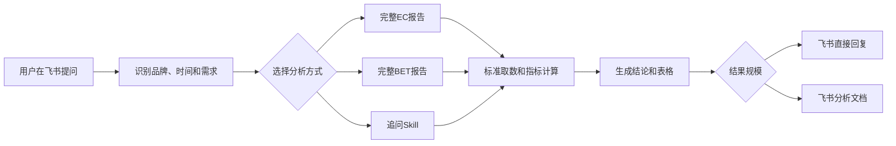

# 北极星 AI 生意问答 Bot 项目说明

> 文档用途：帮助业务人员、新加入的同事、开发人员和 AI 编程助手理解北极星项目。  
> 当前主项目目录：`ai-business-qa-bot/` 。上层目录中的旧版 `main.py`、`bailian.py`、`tools.py` 等文件不是当前 v3 Bot 的主运行入口。

---

# 第一部分：给人看的项目说明

## 1. 这是一个什么项目

北极星是一个连接公司业务数据的飞书分析助手。

用户可以在飞书里用日常语言提问，例如：

- “珀莱雅2026年6月的生意怎么样？”
- “分析韩束2026年3月的媒体投资。”
- “追问：T2主要靠哪些品类？”
- “追问：按月整理RED的BKFS花费结构。”

系统会理解品牌、时间和分析需求，从数据库获取真实数据，计算业务指标，然后生成飞书回复或飞书分析文档。

最重要的原则是：

> AI 负责听懂问题和组织表达；数字由数据库和程序计算；业务口径由固定规则和 Skill 约束。

## 2. 目前支持哪些能力

### 2.1 EC 完整生意分析

用来回答比较宽泛的天猫生意问题，例如“某品牌某时间段生意怎么样”。

报告包括：

- 整体天猫 GMV 及同比；
- 品类结构；
- 重点品类下的产品系列和 Top 链接；
- Key Driver 结构；
- 生意质检和异常数据提示。

这条分析使用固定流程，目的是保证每份报告结构一致、必需指标不遗漏。

### 2.2 BET 完整媒体投资分析

用来回答媒体投资、Social Search、BKFS/BKFST、KOL、Engage 和 CPE 等问题。

报告包括：

- Social Search 表现；
- 媒体花费和 AIT/BKFS 结构；
- NSO 和媒体费比；
- RED 和 DOUYIN 的 KOL 花费、Engage 和 CPE；
- Tier、KOL Type 和 Top KOL。

各数据源会并行查询。如果某个数据源没有该品牌或该时间的数据，系统会说明缺失情况，并继续生成其他可用部分。

### 2.3 深入分析追问

用户可以在完整报告之后继续下钻。建议始终使用“追问：”开头，例如：

- “追问：次抛精华表现怎么样？”
- “追问：NON-KOL主要贡献哪些品类？”
- “追问：哪个品类对GMV下滑的拖累最大？”
- “追问：搜索上涨时，生意有没有同步上涨？”

这类问题会进入受控的动态分析。系统可以根据问题选择分析维度，但只能使用 Skill 合同允许的指标、维度和取数能力。

对于品类等 EC 下钻，系统会跨表综合整体、Key Driver、系列和 SKU 信息，尽量输出“主要由哪个渠道带来”、“生意是否集中在头部系列”等综合结论，而不是只逐表复述最高值。

### 2.4 数据整理追问

用来按时间、维度或排名整理 EC 或 BET 数据，例如：

- “追问：按月整理珀莱雅2026年1—6月的媒体费比。”
- “追问：按月看RED的BKFS花费结构。”
- “追问：按GMV给面膜Top 10链接排名。”

数据整理以表格为主，不主动增加过度解读。

## 3. 用户的一个问题会如何被处理



具体步骤是：

1. 飞书 Bot 收到用户文字消息。
2. 系统提取品牌、时间和问题类型。
3. 系统选择完整 EC 报告、完整 BET 报告或追问 Skill。
4. 标准取数能力从 MySQL 获取数据并计算指标。
5. 格式化模块生成结论、表格和数据说明。
6. 简单结果在飞书中直接回复；完整报告、多表下钻或大表格生成飞书文档。

## 4. 默认分析和追问有什么区别

| 方面 | 默认完整分析 | 追问分析 |
|---|---|---|
| 适用问题 | “品牌某时间整体怎么样” | 某个具体品类、渠道、指标或整理需求 |
| 分析路径 | 事先设计的固定流程 | 根据问题生成受控分析计划 |
| 查询范围 | 固定查询完整模块 | 只查询回答问题必需的数据 |
| 业务约束 | 写在程序流程和报告模板中 | 写在 Skill 方法和执行合同中 |
| 输出 | 固定结构的完整文档 | 针对性结论、表格或专项文档 |

可以将默认分析理解为“标准体检套餐”，将追问理解为“根据具体问题开出的专项检查单”。

## 5. AI 在其中做什么

AI 主要用于：

- 理解用户问题和抽取品牌、时间、意图；
- 在真实品牌候选中辅助进行跨数据源品牌匹配；
- 将追问翻译成结构化的分析计划；
- 在部分完整报告中辅助生成自然语言结论；
- 根据商品标题辅助归纳产品系列。

AI 不能：

- 自己编写或执行任意 SQL；
- 编造品牌、指标、数据维度或数据库中没有的数字；
- 将数据缺失自动补成0；
- 用常识代替业务数据；
- 在没有证据时宣称媒体投入“导致”了生意变化。

## 6. 数据从哪里来

| 业务领域 | 主要数据 |
|---|---|
| EC 整体生意 | ECIP/MASS 天猫 TTL GMV |
| EC 品类、系列、链接和渠道 | 天猫商品链接数据 |
| Social Search | 小红书灵犀 Search Report |
| 媒体投资 | Topline Report |
| EC NSO | `top_brands_total_ec` |
| KOL 花费和互动 | KSI Report |
| 品牌匹配 | 品牌字典、天猫品牌索引和命中缓存 |

同一个品牌在不同数据源中可能使用不同名称。系统会先完成品牌映射，再使用实际命中的品牌值查数，避免将用户输入直接套到所有数据源。

## 7. 结果如何交付

- 完整 EC 和 BET 报告生成飞书文档。
- 分析型追问产生下钻组合表时，生成飞书文档。
- 数据整理只有一张且不超过20行时，直接在飞书聊天中回复。
- 超过20行或包含多张表格时，生成飞书文档。

## 8. 当前业务边界

- 不支持没有接入的大盘、行业或竞品数据。
- 不使用单条 SKU 解释整体同比变化原因。
- 媒体投入与生意可以做同期信号对照，不直接做因果判断。
- BET 完整报告当前以2026年为分析年，使用2025年同期计算变化。
- 产品系列中包含 AI 根据商品标题归纳的部分，报告会附带误差说明。
- 数据口径、刷单规则以及不同系统数字差异需由数据团队确认。

---

# 第二部分：给 AI 和开发者读的代码说明

## 9. Machine-readable summary

```yaml
project:
  name: ai-business-qa-bot
  purpose: Feishu-based EC and BET business analysis assistant
  language: Python
  source_of_truth_root: ai-business-qa-bot/
  runtime_command: python -m bot.main
  transport: Feishu WebSocket long connection
  database: MySQL
  llm_api: DashScope OpenAI-compatible API

production_execution:
  entrypoint: bot.main:main
  message_handler: bot.main:do_p2_im_message_receive_v1
  agent_entry: bot.app:run_agent
  active_runner: bot.app:_run_direct
  graph_status: bot.app:build_graph exists but is not the production source of truth

analysis_paths:
  default_ec: bot.chains.default_chain:run_default_chain
  full_bet: bot.chains.media_chain:run_media_chain
  followup_v2: bot.chains.followup_v2_chain:run_followup_v2_chain

followup_skills:
  - bot/skills/followup/analysis-drill/
  - bot/skills/followup/data-organizer/

required_validation_command: python -m unittest discover -s tests -v
```

## 10. 仓库边界

AI 或开发者开始修改前必须先确认：

1. 当前主代码在 `ai-business-qa-bot/` 中。
2. 上层旧实现应保留，除非用户明确要求删除或迁移。
3. 工作树可能存在用户尚未提交的修改。修改前运行 `git status --short`，不要覆盖无关变更。
4. 真实 `.env` 只存放在本地或 ECS，不得写入文档或提交 Git。

## 11. 主运行链路

```text
Feishu WebSocket message
  -> bot/main.py::do_p2_im_message_receive_v1
  -> bot/session.py::get_session(open_id)
  -> bot/app.py::run_agent
  -> bot/app.py::_run_direct
  -> bot/router.py::route
  -> selected chain
  -> bot/tools/*
  -> MySQL
  -> formatter
  -> bot/main.py publishes chat reply or bot/feishu_doc.py creates document
```

### 11.1 飞书接入层

`bot/main.py` 负责：

- 启动飞书 WebSocket 长连接；
- 只处理 P2P 文字消息；
- 通过进程锁防止同一目录启动多个 Bot；
- 通过 message ID 和短时间内相同请求去重；
- 发送“正在分析”占位消息和更新进度；
- 根据 `meta.document_ready` 判断聊天回复或创建飞书文档。

### 11.2 应用调度层

`bot/app.py::_run_direct` 是当前生产执行的事实入口。

`bot/app.py::build_graph` 虽然存在，但 `run_agent` 当前直接调用 `_run_direct`。不要假设 LangGraph 已经接管生产流程。

## 12. Router 输出和处理器

`bot/router.py::route(user_text, state)` 输出 `RouteResult`。

| `RouteResult.type` | 处理方式 | 说明 |
|---|---|---|
| `meta` | `load_meta_answers()` | Bot 能力说明 |
| `caliber_reject` | 固定回复 | 口径、刷单和数据差异问题 |
| `guide` | 固定引导 | 无法识别问题或信息不足 |
| `clarify_period` | 记录 pending request | 完整 EC 分析缺少时间 |
| `default_chain` | `run_default_chain` | 完整 EC 生意报告 |
| `media_analysis` | `run_media_chain` | 完整 BET 报告 |
| `skill_dispatch` | `run_followup_v2_chain` | 追问 Skills V2 |
| `filter_update` | `run_filter_update` | V2 关闭时的兼容路径 |

路由机制为：

- 明确的“追问：”优先进入追问链路；
- 按月、整理、排名、对比、贡献、拖累、同步和背离等窄范围需求可进入 V2；
- 宽泛 EC 问题进入 `default_chain`；
- 宽泛媒体问题进入 `media_analysis`；
- LLM 分类失败或信心不足时使用确定性规则兜底。

## 13. Session 和上下文

`bot/session.py` 定义：

- `SessionState.history`：最近20条对话；
- `SessionState.pending_request`：等待用户补充品牌或时间的请求；
- `SessionState.ec_context`：EC 品牌、时间、筛选条件和报告缓存；
- `SessionState.bet_context`：BET 品牌、时间、跨数据源品牌和报告缓存；
- `SessionState.drilldown_ctx`：旧追问代码仍需要的兼容上下文。

EC 和 BET 上下文必须保持分离，切换报告类型时不得清除另一个领域的上下文。

当前 Session 保存在单进程内存中；进程重启后上下文会丢失，多实例间也不共享。

## 14. 三条分析链

### 14.1 Default EC chain

主文件：`bot/chains/default_chain.py`。

执行顺序：

1. `query_category`：获取品类结构。
2. `query_ecip_tmall_gmv`：获取 ECIP/MASS 天猫 TTL GMV，作为整体生意口径。
3. `select_drilldown_target`：根据份额和变化自动选择重点品类。
4. `query_series` 和 `query_sku_list`：查询系列和 Top 链接。
5. `query_driver`：查询 Key Driver 结构。
6. `build_fraud_result`：生成生意质检结果。
7. `formatter.format_report`：输出固定结构报告。

口径不变式：

- 整体天猫 TTL GMV 使用 ECIP/MASS 结果；
- 品类、系列、SKU 和 Key Driver 使用商品链接数据；
- 两种数据源必须在报告中分开说明，不得冒充同一个总计口径。

### 14.2 Full BET chain

主文件：`bot/chains/media_chain.py`。

执行顺序：

1. `resolve_media_brand`：在 Search、Topline、KSI 和 NSO 中分别解析品牌。
2. `parse_media_period`：解析分析月份和2025年同期。
3. 并行执行 `query_social_search`、`query_media_investment`、`query_ec_nso`、RED KSI 和 DOUYIN KSI。
4. `media_formatter.format_media_report`：根据固定业务规则生成报告。

口径不变式：

- 2026 年为当前分析年，2025 年为同期；
- 媒体费比使用 Topline 花费除以 TTL NSO；
- CPE 是聚合花费除以聚合 Engage；
- 不将媒体和生意的同期变化写成因果关系；
- 某一数据源缺失时继续生成其他部分，全部来源无法解析时才停止。

### 14.3 Follow-up Skills V2 chain

主文件：

- `bot/followup_plan.py`：生成和校验追问计划；
- `bot/chains/followup_v2_chain.py`：选择并执行取数能力；
- `bot/followup_formatter.py`：生成结论、表格和文档标记。

运行步骤：

1. Planner 将用户问题转换为 `FollowupPlan`。
2. `validate_plan` 根据 Skill 合同验证 domain、mode、filters、group_by、metrics、limit 和时间。
3. LLM 计划不合法时，改用规则计划；两者都不允许生成 SQL。
4. Chain 根据计划调用白名单 Tool。
5. Formatter 使用查询返回的 rows、tables 和 evidence 生成结果。

当前可执行 Skill：

| Skill | 目录 | 用途 |
|---|---|---|
| `analysis_drill` | `bot/skills/followup/analysis-drill/` | 表现、结构、贡献/拖累、对比、EC×BET趋势对照 |
| `data_organizer` | `bot/skills/followup/data-organizer/` | 期间汇总、月度趋势、交叉表和排名 |

Skill 目录中：

- `SKILL.md` 描述业务方法和表达边界；
- `contract.json` 是机器可执行的白名单，控制领域、分析模式、维度、指标、组合、行数和可用 Tool。

`analysis_drill` 的 `insight_rules` 还控制：

- Key Driver 份额达到70%时，可写“生意主要由该 Key Driver 带来”；
- Key Driver 份额达到50%时，可写“生意以该 Key Driver 为主”；
- 头部两个系列合计份额达到60%时，可写“生意较集中在这两个系列”。

## 15. Tool 层

Tool 在 `bot/tools/` 中。`bot/tools/__init__.py::TOOL_REGISTRY` 列出了已登记的查询函数。

但当前主链路仍由 Chain 直接调用 Python 函数；`get_langchain_tools()` 是预留包装，不要假设 LLM 正在进行开放式 Tool Calling Loop。

核心 Tool：

| 领域 | Tool |
|---|---|
| EC 完整报告 | `query_category`、`query_ecip_tmall_gmv`、`query_series`、`query_sku_list`、`query_driver` |
| BET 完整报告 | `query_social_search`、`query_media_investment`、`query_ec_nso`、`query_kol_performance` |
| EC 追问 | `query_ec_followup_table` |
| BET 追问 | `query_bet_followup_table` |
| 贡献/拖累 | `query_change_contribution` |
| EC×BET按月对齐 | `query_ec_bet_monthly` |

Tool 应保持以下约定：

- SQL 由程序固定维护，参数使用 SQLAlchemy 绑定；
- 不接收 LLM 生成的 SQL；
- 追问 Tool 统一返回 `query_meta`、`filters`、`totals`、`rows`、`coverage`、`missing` 和 `evidence`；
- 缺失月份保留为缺失，不补零、不插值；
- 同比、份额、CPE、费比和贡献度在 Python/SQL 中计算，不交给 LLM 心算。

## 16. 数据表和查询来源

| 数据表 | 用途 |
|---|---|
| `ai_bot_tmall_product_link` | EC 品类、系列、SKU、Key Driver 和追问 |
| `three_platform_store_rank_monthly` | ECIP/MASS 完整月 TTL GMV |
| `tmall_store_ranking_day_jiashicang` | ECIP/MASS 日级或不完整月 TTL GMV |
| `ai_bot_media_search_index` | Social Search |
| `ai_bot_media_topline_investment` | 媒体投资、AIT 和 BKFS/BKFST |
| `top_brands_total_ec` | EC NSO |
| `ai_bot_media_ksi_performance` | KOL 花费、Engage 和 CPE |
| `ai_bot_brand_dictionary` | 跨数据源品牌字典 |
| `ai_bot_tmall_brand_index` | 天猫店铺和真实品牌索引 |
| `ai_bot_brand_resolution_cache` / `ai_bot_source_brand_resolution_cache` | 品牌解析缓存 |

MySQL 连接封装在 `bot/db/connection.py`，包括连接池、超时和慢查询日志。

## 17. 品牌解析

主文件：`bot/media_brand.py` 和 `bot/tools/common.py`。

基本原则：

1. 先查持久化品牌映射缓存。
2. EC 优先使用天猫品牌索引匹配 `store_CN`、`store_EN` 和真实 `brand_name`。
3. BET 根据数据源分别查找 Search、Topline、KSI 和 NSO 的真实品牌值。
4. 只有真实候选多于一个时才让 LLM 辅助消歧。
5. LLM 返回值必须是候选集合中的原值，不得自由生成品牌。
6. 高置信度映射写入缓存；缺失来源不做长期负缓存。

## 18. Formatter 和输出

| 文件 | 用途 |
|---|---|
| `bot/formatter.py` | 完整 EC 报告；固定表格与模块，部分 insight 使用 LLM，失败时回退到确定性文案 |
| `bot/media_formatter.py` | 完整 BET 报告；主要根据固定规则生成 |
| `bot/followup_formatter.py` | 追问结论和表格；分析下钻会跨表综合，数据整理保持表格导向 |
| `bot/feishu_doc.py` | 将 Markdown 解析成飞书文档 Block，包括标题、表格和段落 |

追问文档规则：

- `analysis_drill` 生成下钻组合表时，`document_ready=True`；
- 数据整理超过20行或多于1张表时，`document_ready=True`；
- 其他简短结果在聊天中直接回复。

## 19. 数据导入和维护

`data_import/` 包含离线数据准备和 MySQL 写入脚本：

- `import_parquet_to_mysql.py`：历史商品和直播 Parquet 导入；
- `search_pipeline.py`：Search Report 清洗与入库；
- `topline_pipeline.py`：Topline 清洗、BKFS 标签与入库；
- `ksi_pipeline.py`：KSI 大文件流式清洗与入库；
- `brand_dictionary_pipeline.py`：刷新跨数据源品牌字典；
- `tmall_brand_index_pipeline.py`：刷新天猫店铺/品牌索引；
- `media_runtime_migration.py`：创建或补齐运行表、字段和索引。

每次月度数据更新后，应同步刷新品牌字典和天猫品牌索引。

## 20. 环境变量

参考 `.env.example`，不要在代码中写死密钥。

必填类别：

- `MYSQL_HOST`、`MYSQL_PORT`、`MYSQL_USER`、`MYSQL_PASSWORD`、`MYSQL_DATABASE`；
- `FEISHU_APP_ID`、`FEISHU_APP_SECRET`；
- `DASHSCOPE_API_KEY`、`DASHSCOPE_BASE_URL`、各模型名称。

重要开关：

```env
FOLLOWUP_SKILL_V2_ENABLED=1
FOLLOWUP_SKILL_V2_SHADOW=0
FOLLOWUP_PLAN_TIMEOUT=12
```

- `ENABLED=1`：追问 V2 正式生效。
- `ENABLED=0` 且 `SHADOW=1`：保留旧回答，同时记录 V2 计划和验证结果。

## 21. 不可破坏的系统不变式

AI 或开发者修改代码时必须保持：

1. **数字来源**：所有业务数字来自 Tool 返回，不得由 LLM 编造或心算。
2. **SQL 边界**：不接收或执行模型生成的任意 SQL。
3. **品牌验证**：跨源品牌必须从真实候选中选择，不得将用户输入静默套用到所有数据源。
4. **缺失值**：缺失保持为 `—`/`None`，不补零，不插值。
5. **同比基期**：基期缺失时不伪造 Evol%，应显示“同期无数据”或 `—`。
6. **媒体因果**：只描述同步、背离和同期信号，不声称媒体投入造成生意变化。
7. **SKU 归因**：单条 SKU 只用于表现和排名，不用于整体变化归因。
8. **系列声明**：涉及 AI 归纳系列时保留误差说明。
9. **上下文隔离**：EC 和 BET 上下文不得互相覆盖。
10. **输出分层**：完整报告和多表下钻进飞书文档，小型单表数据整理留在聊天。

## 22. 测试和验收

完整测试：

```bash
python -m unittest discover -s tests -v
```

主要测试文件：

| 文件 | 覆盖内容 |
|---|---|
| `tests/test_ec_analysis.py` | EC 品牌、时间、口径、默认报告和 ECIP GMV |
| `tests/test_media_analysis.py` | BET 路由、品牌解析、Tool、报告和指标口径 |
| `tests/test_followup_v2.py` | 追问路由、Plan 校验、Skill 合同、Tool、Insight 和文档规则 |
| `tests/test_*_pipeline.py` | Search、Topline、KSI 等离线数据清洗 |

修改一个子系统时，先运行对应定向测试，最后必须运行完整测试。

当前基线：118项测试通过。如果测试数量在后续变化，以当前完整测试输出为准。

## 23. 常见修改应该去哪里

| 需求 | 优先检查/修改 |
|---|---|
| 增加新的问题类型 | `bot/router.py` 和路由测试 |
| 调整 EC 完整报告顺序 | `bot/chains/default_chain.py` 和 `bot/formatter.py` |
| 调整 BET 报告 | `bot/chains/media_chain.py`、`bot/media_formatter.py` 和媒体测试 |
| 增加追问维度或指标 | 相应 `contract.json`、`followup_plan.py`、追问 Tool 和测试 |
| 调整追问业务表达 | `SKILL.md`、`contract.json` 中的 insight 规则、`followup_formatter.py` |
| 调整飞书文档排版 | `bot/feishu_doc.py` |
| 调整 Bot 能力说明 | `bot/skills/meta_answers.md` |
| 增加数据源 | 先增加离线入库/迁移，再增加 Tool，最后接入 Chain 和 Formatter |

## 24. 已知技术边界

- Bot 目前只处理飞书 P2P 文字消息。
- Session 使用单进程内存，重启丢失，不支持多实例共享。
- 本地 JSON 去重和进程锁使当前部署更适合单 ECS 实例。
- `build_graph()` 和 LangChain Tool wrapper 为预留能力，不是当前生产主链。
- 完整报告与追问还是“固定 Chain + 受控 Planner”的混合架构，不是开放式自主 Agent Loop。

## 25. 运行、部署和连接文档

- 本地/服务器运行说明：[`../README.md`](../README.md)
- ECS、SCP 和 MySQL 连接：[`ECS_SCP_MySQL连接操作指南.md`](ECS_SCP_MySQL连接操作指南.md)
- 追问 Skills V2：[`followup_skills_v2.md`](followup_skills_v2.md)
- BET 运行口径：[`media_analysis_runtime.md`](media_analysis_runtime.md)
- Search、Topline 和 KSI 数据管道：对应 `docs/*_data_pipeline.md`

## 26. AI 接手时的最短检查清单

```text
1. Confirm cwd is ai-business-qa-bot/.
2. Run git status --short and preserve unrelated user changes.
3. Read bot/main.py, bot/app.py, bot/router.py and the target chain.
4. If changing follow-up behavior, read both SKILL.md and contract.json.
5. Trace the exact Tool and source table; do not infer the data contract.
6. Keep numeric calculations outside the LLM.
7. Add or update focused tests.
8. Run the complete unittest suite.
9. Report whether code was only changed locally or also deployed to ECS.
```
